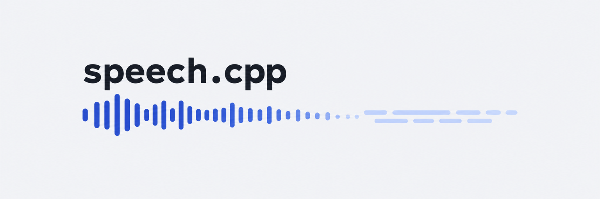

<p align="center"></p>

speech.cpp runs speech synthesis, speech recognition and voice activity detection models for voice conversation in C++
on [ggml](https://github.com/ggml-org/ggml), behind one C API, on the CPU, Metal and Vulkan.

[Models](#models) | [Install](#install) | [Quick start](#quick-start) | [Documentation](#documentation) |
[C API](docs/c-api.md)

It is one command, `speech`, and one shared library, `libspeech`. The command speaks text, writes the text of
recordings, finds where someone speaks in them, serves OpenAI's audio API over HTTP, and runs the worker process that
[ASIST](https://github.com/nyosegawa/asist) starts. Every stage of every model is checked against the model's official
implementation.

## Models

| Task | Name | Languages | Good at |
|---|---|---|---|
| Synthesis | [`qwen3-tts-0.6b`](https://huggingface.co/sakasegawa/Qwen3-TTS-12Hz-0.6B-CustomVoice-GGUF), [`qwen3-tts-1.7b`](https://huggingface.co/sakasegawa/Qwen3-TTS-12Hz-1.7B-CustomVoice-GGUF) | de en es fr it ja ko pt ru zh | nine named speakers; audio that streams from its first frame of 0.08 s; the 1.7B model follows an instruction of how to speak |
| Synthesis | [`irodori-tts-mf`](https://huggingface.co/sakasegawa/Irodori-TTS-v4.1-Small-MF-GGUF), [`irodori-tts`](https://huggingface.co/sakasegawa/Irodori-TTS-v4.1-Small-GGUF) | ja | Japanese in the voice of a reference recording, or in a voice described in words |
| Recognition | [`qwen3-asr-0.6b`](https://huggingface.co/sakasegawa/Qwen3-ASR-0.6B-GGUF), [`qwen3-asr-1.7b`](https://huggingface.co/sakasegawa/Qwen3-ASR-1.7B-GGUF) | 30 languages | finds the language itself, takes a prompt of names and terms, and up to 20 minutes at once |
| Recognition | [`reazonspeech-v2`](https://huggingface.co/sakasegawa/reazonspeech-nemo-v2-GGUF) | ja | Japanese with punctuation, in recordings of many minutes |
| Recognition | [`parakeet-tdt_ctc-0.6b-ja`](https://huggingface.co/sakasegawa/parakeet-tdt_ctc-0.6b-ja-GGUF) | ja | short Japanese utterances, fast, with times |
| Recognition | [`parakeet-tdt-0.6b-v3`](https://huggingface.co/sakasegawa/parakeet-tdt-0.6b-v3-GGUF) | 25 European languages | finds the language itself, with punctuation, capitals and times |
| Detection | [`silero-vad`](https://huggingface.co/sakasegawa/silero-vad-GGUF) | any | where someone speaks, to give a recognizer one utterance at a time; 1.2 MB |

A command takes a model by its name and fetches its converted file from Hugging Face, from the repository the name links
to, the first time. [docs/models.md](docs/models.md) lists the models with their sizes, voices and languages, and each
family has a page: [Qwen3-TTS](docs/models/qwen3-tts.md), [Irodori-TTS](docs/models/irodori-tts.md),
[FastConformer](docs/models/fastconformer.md), [Qwen3-ASR](docs/models/qwen3-asr.md) and
[Silero VAD](docs/models/silero-vad.md).

## Install

macOS on Apple silicon and Linux on x86-64:

```sh
curl -fsSL https://raw.githubusercontent.com/nyosegawa/speech.cpp/main/install.sh | sh
```

Windows x64, in PowerShell:

```powershell
irm https://raw.githubusercontent.com/nyosegawa/speech.cpp/main/install.ps1 | iex
```

The installer checks the release's archive against its SHA-256, puts `speech` under your home folder, and adds it to
`PATH`. Run it again to update. On Linux it installs the Vulkan build when the Vulkan loader is installed, and the CPU
build otherwise; the Linux builds need glibc 2.34 or later. [docs/install.md](docs/install.md) has the options, how to
uninstall, and what each platform needs. On an Intel Mac or another system, [build from source](docs/install.md#build-from-source).

## Quick start

1. Speak a sentence. The model is fetched the first time (1.21 GB):

   ```sh
   speech tts qwen3-tts-0.6b --voice ryan -o hello.wav "Hello. It will be sunny in Tokyo tomorrow."
   ```

2. Write its text back (0.84 GB the first time):

   ```sh
   speech asr qwen3-asr-0.6b hello.wav
   ```

   ```
   Hello, it will be sunny in Tokyo tomorrow.
   ```

3. Open a page on which to pick models, speak and transcribe:

   ```sh
   speech serve --open
   ```

`speech models` lists every model and, for each language, the model to start with.

## Command line

| Subcommand | What it does |
|---|---|
| `speech tts` | speaks text into a WAVE file or to stdout |
| `speech asr` | writes the text of WAVE files, or of the microphone as someone speaks |
| `speech vad` | writes where someone speaks in WAVE files |
| `speech voice` | makes an Irodori-TTS voice file from reference recordings |
| `speech info` | prints what a model file says of its model |
| `speech devices` | lists the devices a model can run on |
| `speech models`, `pull`, `rm` | list, fetch and remove models |
| `speech quantize` | writes a model file of F32 weights in F16, Q8_0 or a smaller type |
| `speech serve` | serves models over HTTP with OpenAI's audio API, and a page to try them |
| `speech worker` | serves a model over JSON Lines on stdin and stdout, for programs |

```sh
speech voice irodori-tts-mf me.wav me.voice.gguf
speech tts irodori-tts-mf --add-voice me=me.voice.gguf --voice me -o - < story.txt | ffplay -nodisp -autoexit -
speech asr reazonspeech-v2 --timestamps meeting.wav
speech asr qwen3-asr-1.7b --language ja --prompt "Claude Code、渋谷" meeting.wav
speech asr reazonspeech-v2 --vad silero-vad --live
speech vad silero-vad --max-speech-duration-s 10 meeting.wav
```

Every request option is a flag, and `speech info MODEL` lists the ones a model takes. [docs/cli.md](docs/cli.md) lists
every subcommand and option.

## Server and page

`speech serve` holds a synthesis model, a recognition model and a detection model, and answers
`POST /v1/audio/speech` and `POST /v1/audio/transcriptions` as OpenAI's audio API does, for a web app, a script or curl:

```sh
speech serve qwen3-tts-0.6b qwen3-asr-0.6b
curl http://127.0.0.1:8080/v1/audio/speech -H 'Content-Type: application/json' \
    -d '{"input": "Hello.", "voice": "ryan"}' -o hello.wav
curl http://127.0.0.1:8080/v1/audio/transcriptions -F file=@hello.wav
```

It listens on 127.0.0.1 and has no authentication. [docs/server.md](docs/server.md) has the endpoints, the formats, the
errors and the page.

## Using the library

A program links `libspeech` and includes `speech.h`, from a release archive:

```c
speech_model * model = NULL;
speech_request * request = NULL;
speech_model_load("Qwen3-TTS-12Hz-0.6B-CustomVoice-Q8_0.gguf", NULL, &model);
speech_request_new(model, &request);
speech_request_set_text(request, "Hello.");
speech_request_set_string(request, SPEECH_OPT_VOICE, "ryan");
speech_synthesize(request, on_audio, NULL);   /* on_audio receives the samples as they are made */
```

Each call returns a status whose category says what failed. [docs/c-api.md](docs/c-api.md) has the whole API.

A program that would rather not link a library starts `speech worker MODEL` and speaks JSON Lines with it, as ASIST
does: one request per line on stdin, its audio or text and one terminal message on stdout.
[docs/worker.md](docs/worker.md) has the protocol.

## Accuracy and speed

Every stage of each port is compared with tensors dumped from the official implementation. The recognizers write the
official text on every check input in F32 and F16.

Measured with [speech-bench](https://github.com/nyosegawa/speech-bench) on 2026-10-08, on an Apple M5 (Metal) and an
RTX 2080 (Vulkan), one request at a time. Speech: 20 Japanese sentences, the time to the first audio, the real-time
factor, and the CER of the speech as Qwen3-ASR 1.7B hears it.

| Model | First audio, M5 / RTX 2080 | Real-time factor | CER |
|---|---|---|---|
| `qwen3-tts-0.6b`, Q8_0 | 0.04 s / 0.03 s | 0.31 / 0.27 | 5.8% / 8.0% |
| `qwen3-tts-1.7b`, Q8_0 | 0.06 s / 0.04 s | 0.42 / 0.32 | 3.0% / 2.8% |
| `irodori-tts-mf`, F16 | 0.25 s / 0.12 s | 0.17 / 0.07 | 6.1% / 7.1% |
| `irodori-tts`, F16, 16 steps | 1.24 s / 0.52 s | 0.34 / 0.13 | 3.2% / 3.2% |

Recognition: the 4,483 utterances of Common Voice 8.0's Japanese test set, trimmed to the voice, with the CER that
accepts other spellings of the same words in parentheses, and parakeet-tdt-0.6b-v3 on 300 English utterances of FLEURS.

| Model | CER on Common Voice ja | Median time, M5 / RTX 2080 |
|---|---|---|
| `parakeet-tdt_ctc-0.6b-ja`, F16 | 7.9% (3.0%) | 0.06 s / 0.07 s |
| `reazonspeech-v2`, F16 | 12.0% (7.1%) | 0.11 s / 0.16 s |
| `qwen3-asr-0.6b`, Q8_0 | 11.9% (7.0%) | 0.13 s / 0.09 s |
| `qwen3-asr-1.7b`, Q8_0 | 9.5% (4.7%) | 0.31 s / 0.16 s |
| `parakeet-tdt-0.6b-v3`, F16 | WER 8.8% on FLEURS en | 0.10 s / 0.15 s |

Each model's page has more.

## Documentation

| Page | What it covers |
|---|---|
| [Install](docs/install.md) | installers, updating, uninstalling, requirements, release archives and building from source |
| [Command line](docs/cli.md) | every subcommand and option |
| [Models](docs/models.md) | the catalog, names, where models are kept, voices and languages |
| [Qwen3-TTS](docs/models/qwen3-tts.md), [Irodori-TTS](docs/models/irodori-tts.md), [FastConformer](docs/models/fastconformer.md), [Qwen3-ASR](docs/models/qwen3-asr.md), [Silero VAD](docs/models/silero-vad.md) | each family: what it does, its options, accuracy and speed |
| [Server and page](docs/server.md) | `speech serve` and OpenAI's audio API |
| [Worker protocol](docs/worker.md) | `speech worker` for programs |
| [C API](docs/c-api.md) | `speech.h` |

## License

MIT, see [LICENSE](LICENSE). The model weights are their authors':

- Qwen3-TTS and Qwen3-ASR are the Qwen team's, under the Apache License 2.0.
- Irodori-TTS v4.1-Small and v4.1-Small-MF are Aratako's, under the MIT License with the ethical restrictions of their
  model cards: no voice cloning without consent, no deepfakes or misinformation.
- Semantic-DACVAE-Japanese-32dim, the codec in the Irodori-TTS files, is Aratako's under the MIT License. It derives
  from Meta's facebook/dacvae-watermarked, under the Apache License 2.0; the SAM License that its card's text also
  names was corrected to Apache-2.0 in facebookresearch/dacvae on 2025-12-19.
- The parakeet models are NVIDIA's, under CC-BY-4.0, and reazonspeech-nemo-v2 is reazon-research's, under the Apache
  License 2.0.
- Silero VAD is the Silero Team's, under the MIT License.
